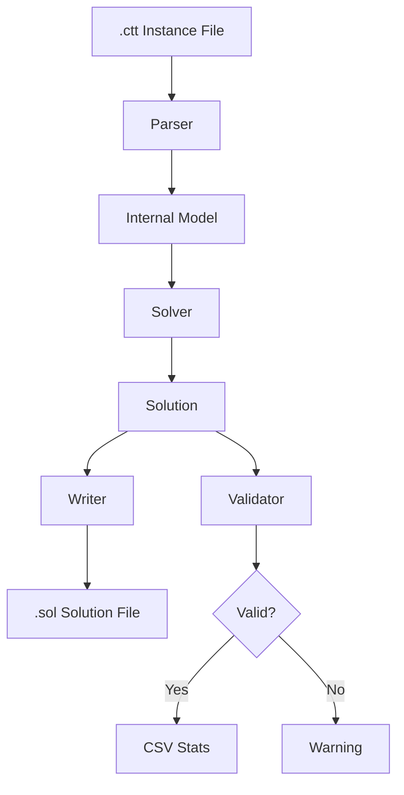
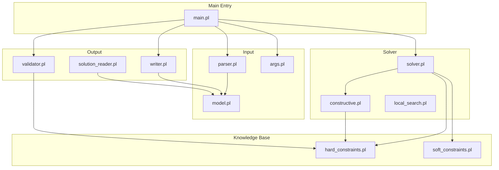

# ITC2007 Course Timetabling Expert System - Project Documentation

## Project Overview

This is a **rule-based expert system** implemented in **SWI-Prolog** for solving the ITC2007 Track 2 (Curriculum-based Course Timetabling) problem. The system takes instance files (.ctt format) and produces feasible timetables while optimizing soft constraints.

### What is ITC2007 Track 2?

The International Timetabling Competition 2007 Track 2 involves scheduling university course lectures into time slots and rooms, considering:
- **Hard constraints**: Must be satisfied (feasibility)
- **Soft constraints**: Should be satisfied but violations add penalty cost

---

## System Architecture

### High-Level Workflow



### Module Dependency Graph



---

## Module Descriptions

### 1. Input Layer

#### `src/itc2007/model.pl`
**Purpose**: Defines the internal data structures for the timetabling problem.

```prolog
% Instance dict structure:
instance{
    name:string,           % Instance name
    days:integer,           % Number of days in planning horizon
    periods_per_day:integer,% Periods per day
    courses_count:integer,  % Number of courses
    rooms_count:integer,   % Number of rooms
    curricula_count:integer,% Number of curricula
    constraints_count:integer,% Unavailability constraints
    courses:[course(...)]  % List of course terms
    rooms:[room(...)]       % List of room terms
    curricula:[curriculum(...)] % List of curriculum terms
    unavailability:[unavailable(...)] % Unavailable slots
}

% Course: course(CourseId, TeacherId, Lectures, MinDays, Students)
% Room: room(RoomId, Capacity)
% Curriculum: curriculum(CurriculumId, [CourseId1, CourseId2, ...])
% Unavailable: unavailable(CourseId, Day, Period)
% Assignment: assignment(CourseId, LectureIndex, Day, Period, RoomId)
```

**Key Predicates**:
- `empty_instance/1` - Creates an empty instance dict
- `add_course/3` - Adds a course to instance
- `add_room/3` - Adds a room to instance
- `add_curriculum/3` - Adds a curriculum to instance
- `add_unavailability/5` - Adds unavailability constraint

---

#### `src/itc2007/parser.pl`
**Purpose**: Parses ITC2007 Track 2 `.ctt` files into internal model.

```prolog
% Public API:
read_instance(+FilePath, -Instance)
```

**Parsing Process**:
1. Read entire file into string
2. Split by newlines
3. Parse header (Name, Courses, Rooms, Days, etc.)
4. Parse sections:
   - `COURSES:` - Course definitions
   - `ROOMS:` - Room definitions  
   - `CURRICULA:` - Curriculum definitions
   - `UNAVAILABILITY_CONSTRAINTS:` - Unavailable periods
   - `END.` - End marker

**Example `.ctt` file format**:
```
Name: COMP01
Courses: 30
Rooms: 6
Days: 5
Periods_per_day: 6
Curricula: 14
Constraints: 53

COURSES:
C1 T1 3 2 50
C2 T2 2 1 30
...

ROOMS:
R1 80
R2 120
...

CURRICULA:
CUR1 3 C1 C2 C3
...

UNAVAILABILITY_CONSTRAINTS:
C1 0 0
...

END.
```

---

#### `src/utils/args.pl`
**Purpose**: Command-line argument parsing.

```prolog
% Public API:
parse_args(+Argv, -Opts)
print_help/0
```

**Supported Options**:
| Flag | Description | Required |
|------|-------------|----------|
| `--instance <path>` | ITC2007 instance file (.ctt) | Yes |
| `--out <path>` | Output solution file (.sol) | Yes |
| `--csv <path>` | Write stats CSV | No |
| `--seed <int>` | RNG seed | No |
| `--timelimit <sec>` | Time limit in seconds | No |

---

### 2. Knowledge Base (Rules)

#### `src/rules/hard_constraints.pl`
**Purpose**: Enforces hard constraints - a solution is **feasible** only if ALL these are satisfied.

```prolog
% Public API:
feasible(+Instance, +Solution)    % Succeeds if no violations
violates(+Instance, +Solution, -Reason)  % Find violation reason
violates_partial(+Instance, +Solution, -Reason)  % For partial solutions
```

**Hard Constraints Implemented**:

| Constraint | Description | Violation Term |
|------------|-------------|----------------|
| Lectures | All lectures must be scheduled | `missing_lecture(Course)` |
| Room Occupancy | Two courses cannot share same room/period | `room_conflict(Day,Period,Room)` |
| Course Conflict | Same course can't have two lectures same period | `course_conflict(Course,Day,Period)` |
| Teacher Conflict | Teacher can't teach two courses same period | `teacher_conflict(Teacher,Day,Period)` |
| Curriculum Conflict | Courses in same curriculum can't overlap | `curriculum_conflict(Curriculum,Day,Period)` |
| Unavailability | Course can't be in unavailable period | `unavailability(Course,Day,Period)` |

---

#### `src/rules/soft_constraints.pl`
**Purpose**: Calculates penalty cost for soft constraint violations.

```prolog
% Public API:
penalty(+Instance, +Solution, -TotalPenalty)
```

**Soft Constraints (with ITC2007 weights)**:

| Constraint | Weight | Formula |
|------------|--------|---------|
| Room Capacity | 1 | `sum(max(0, students - capacity))` |
| Minimum Working Days | 5 | `sum(max(0, minDays - actualDays) * 5)` |
| Curriculum Compactness | 2 | `2 × isolated_lectures` |
| Room Stability | 1 | `sum(extra_rooms_used - 1)` |

**Detailed Explanation**:

1. **Room Capacity**: For each lecture, if students > room capacity, add (students - capacity) to penalty
2. **Minimum Working Days**: Each course should spread lectures across minDays. Penalty = (minDays - actualDays) × 5
3. **Curriculum Compactness**: Lectures in same curriculum should be adjacent (consecutive periods). Each isolated lecture adds 2 points
4. **Room Stability**: All lectures of a course should be in the same room. Each extra room adds 1 point

---

### 3. Solver Engine

#### `src/solver/solver.pl`
**Purpose**: Main solver - orchestrates construction and optimization.

```prolog
% Public API:
solve(+Instance, +Opts, -Solution, -Stats)
```

**Flow**:
1. Call constructive phase to build initial solution
2. Check hard constraints (feasibility)
3. Calculate soft constraint penalty
4. Return solution + statistics

```prolog
solve(Instance, Opts, Solution, Stats) :-
    constructive:construct(Instance, Solution0),  % Build initial solution
    (hard_constraints:feasible(Instance, Solution0) -> Feasible=true ; Feasible=false),
    soft_constraints:penalty(Instance, Solution0, Penalty),
    Stats = stats{feasible:Feasible, penalty:Penalty}.
```

---

#### `src/solver/constructive.pl`
**Purpose**: Greedy algorithm to construct initial timetable.

```prolog
% Public API:
construct(+Instance, -Solution)
```

**Algorithm**:
1. Generate all (day, period) slots
2. Generate all lecture tasks (one per lecture of each course)
3. Sort tasks by difficulty (courses with more unavailability constraints first)
4. For each task:
   - Try to place in random slot that doesn't violate constraints
   - Retry with different order if fails (up to 30 attempts)
5. Return complete assignment list

**Key Data Structures**:
- `task(Course, LectureIndex)` - One task per lecture
- `slot(Day, Period)` - Available time slot
- `assignment(Course, LectureIndex, Day, Period, RoomId)` - Final assignment

**Helper Maps** (for O(1) conflict checking):
- Teacher map: Course → Teacher
- Curriculum map: Course → [CurriculumIds]

---

#### `src/solver/local_search.pl`
**Purpose**: (Placeholder) Improvement phase for reducing penalty.

```prolog
% Public API:
improve(+Instance, +InitialSolution, +Opts, -ImprovedSolution)
```

**Current Status**: Returns same solution (no optimization implemented)

**Future Enhancement Ideas**:
- Tabu search
- Simulated annealing
- Hill climbing
- Swap moves (exchange two lectures)
- Kempe chain moves

---

### 4. Output Layer

#### `src/output/writer.pl`
**Purpose**: Writes solution to files.

```prolog
% Public API:
write_solution(+Path, +Solution)
write_csv(+Path, +Stats)
```

**Solution Format** (`.sol` file):
```
CourseId RoomId Day Period
C1 R1 0 1
C2 R3 2 4
...
```

**CSV Format** (statistics):
```csv
feasible,penalty
true,3020
```

---

#### `src/output/validator.pl`
**Purpose**: Validates solution against hard constraints.

```prolog
% Public API:
check_hard_constraints(+Instance, +Solution)
```

---

#### `src/output/solution_reader.pl`
**Purpose**: Reads `.sol` files back into internal format.

```prolog
% Public API:
read_solution(+Path, -Assignments)
```

---

### 5. Main Entry Point

#### `src/main.pl`
**Purpose**: Command-line interface.

```prolog
% Usage:
% swipl -q -g "[src/main], main(['--instance','data/itc2007/comp01.ctt','--out','results/comp01.sol'])" -t halt
```

**Flow**:
1. Parse command-line arguments
2. Read instance file
3. Solve
4. Write solution
5. Validate (warn if infeasible)
6. Write CSV stats (if requested)
7. Exit with code:
   - 0: Success (feasible)
   - 1: Error
   - 2: Infeasible (violates hard constraints)

---

## Data Flow Example

### Input: comp01.ctt (excerpt)
```
Name: comp01
Courses: 30
Rooms: 6
Days: 5
Periods_per_day: 6

COURSES:
C1 T1 5 2 100
C2 T2 3 2 80
...

CURRICULA:
CUR1 3 C1 C2 C3
...
```

### Internal Model
```prolog
Instance = instance{
    name:'comp01',
    days:5,
    periods_per_day:6,
    courses:[
        course('C1','T1',5,2,100),
        course('C2','T2',3,2,80),
        ...
    ],
    rooms:[
        room('R1',100),
        room('R2',150),
        ...
    ],
    curricula:[
        curriculum('CUR1',['C1','C2','C3']),
        ...
    ],
    unavailability:[
        unavailable('C1',0,0),
        ...
    ]
}
```

### Solution
```prolog
Solution = [
    assignment('C1',0,0,1,'R1'),
    assignment('C1',1,1,2,'R1'),
    assignment('C1',2,2,0,'R2'),
    assignment('C1',3,3,1,'R1'),
    assignment('C1',4,4,2,'R1'),
    assignment('C2',0,0,2,'R3'),
    ...
]
```

### Statistics
```prolog
Stats = stats{
    feasible:true,
    penalty:3020
}
```

---

## Running the System

### Quick Start
```bash
# Run solver
make run

# Run with custom instance
make run INSTANCE=data/itc2007/comp02.ctt OUT=results/comp02.sol

# Run tests
make test

# Validate a solution
make validate INSTANCE=data/itc2007/comp01.ctt SOL=results/comp01.sol
```

### Direct SWI-Prolog
```bash
swipl -q -g "[src/main], main([
    '--instance','data/itc2007/comp01.ctt',
    '--out','results/comp01.sol',
    '--csv','results/comp01.csv',
    '--seed','42',
    '--timelimit','60'
])" -t halt
```

---

## Project Structure

```
project/
├── src/
│   ├── main.pl                      # Entry point
│   ├── validate.pl                   # Standalone validator
│   ├── itc2007/
│   │   ├── model.pl               # Data structures
│   │   └── parser.pl              # .ctt file parser
│   ├── rules/
│   │   ├── hard_constraints.pl    # Feasibility rules
│   │   └── soft_constraints.pl    # Penalty calculation
│   ├── solver/
│   │   ├── solver.pl               # Main solver
│   │   ├── constructive.pl        # Greedy construction
│   │   └── local_search.pl        # Improvement (placeholder)
│   ├── output/
│   │   ├── writer.pl               # Write .sol and .csv
│   │   ├── validator.pl            # Validate constraints
│   │   └── solution_reader.pl     # Read .sol files
│   └── utils/
│       └── args.pl                 # Argument parsing
├── tests/
│   ├── test_runner.pl
│   ├── test_parser.pl
│   ├── test_constructive.pl
│   └── fixtures/
│       └── mini.ctt               # Small test instance
├── data/
│   └── itc2007/                  # ITC2007 instances
├── results/                       # Output files
├── docs/                         # Documentation
└── Makefile
```

---

## Contribution Guidelines

### Adding a New Module
1. Create `src/<subdir>/<module>.pl`
2. Declare module with exports
3. Add imports (library and local modules)
4. Write predicates following naming conventions:
   - Predicates: snake_case
   - Variables: Capitalized
   - Atoms: lowercase

### Adding Tests
1. Create `tests/test_<module>.pl`
2. Use plunit format:
```prolog
:- begin_tests(module_name).
:- use_module(src/path/to/module).

test(test_name) :-
    % test code
    assertion(condition).

:- end_tests(module_name).
```

### Adding Soft Constraints
1. Add calculation predicate in `soft_constraints.pl`
2. Add weight to total in `penalty/3`
3. Test with known instance

---

## References

- ITC2007 Competition: https://www.unitime.org/itc2007/
- Track 2 Problem Specification: See `docs/references/`
- SWI-Prolog Documentation: https://www.swi-prolog.org/

---

*Last Updated: 2026-03-14*
