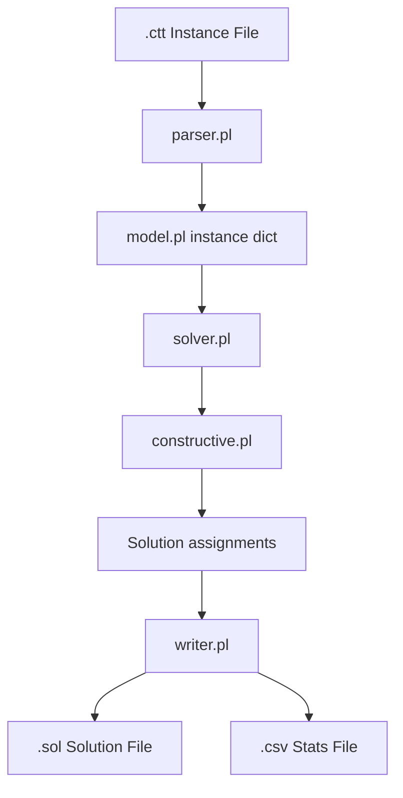
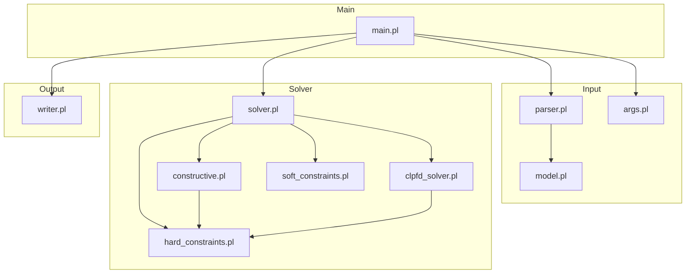

# ITC2007 Course Timetabling Expert System - Project Documentation

## Project Overview

This project is a SWI-Prolog solver for ITC2007 Track 2 course timetabling.
It reads an instance in `.ctt` format, builds an internal model, constructs a
feasible timetable, and writes a `.sol` file plus optional CSV statistics.

## Workflow



## Module Dependency Graph



## Modules

### `src/itc2007/model.pl`

Defines the in-memory instance structure.

```prolog
instance{
    name:string,
    days:integer,
    periods_per_day:integer,
    courses_count:integer,
    rooms_count:integer,
    curricula_count:integer,
    constraints_count:integer,
    courses:[course(...)],
    rooms:[room(...)],
    curricula:[curriculum(...)],
    unavailability:[unavailable(...)]
}
```

Key predicates:

- `empty_instance/1`
- `add_course/3`
- `add_room/3`
- `add_curriculum/3`
- `add_unavailability/5`

### `src/itc2007/parser.pl`

Parses official ITC2007 Track 2 `.ctt` files.

```prolog
read_instance(+FilePath, -Instance)
```

Expected section order:

1. header lines such as `Name:` and `Days:`
2. `COURSES:`
3. `ROOMS:`
4. `CURRICULA:`
5. `UNAVAILABILITY_CONSTRAINTS:`
6. `END.`

### `src/utils/args.pl`

Parses command-line options for the main solver entry point.

Supported flags:

- `--instance <path>`
- `--out <path>`
- `--csv <path>`
- `--seed <int>`
- `--timelimit <sec>`

### `src/rules/hard_constraints.pl`

Checks timetable feasibility.

```prolog
feasible(+Instance, +Solution)
violates(+Instance, +Solution, -Reason)
violates_partial(+Instance, +Solution, -Reason)
```

It covers lecture completion, room conflicts, teacher conflicts, curriculum
conflicts, and course unavailability.

### `src/rules/soft_constraints.pl`

Computes the ITC2007 penalty score.

```prolog
penalty(+Instance, +Solution, -TotalPenalty)
```

Implemented soft constraints:

- room capacity
- minimum working days
- curriculum compactness
- room stability

### `src/solver/constructive.pl`

Builds a timetable directly using a constructive search strategy.

```prolog
construct(+Instance, -Solution)
```

High-level approach:

1. generate lecture tasks
2. generate available slots
3. order tasks by difficulty
4. place lectures while avoiding hard-constraint violations
5. retry with different orderings if needed

### `src/solver/clpfd_solver.pl`

Builds a timetable by posting hard constraints with `library(clpfd)` and then
labeling slot and room variables.

```prolog
construct(+Instance, -Solution)
```

### `src/solver/solver.pl`

Coordinates solving and statistics generation.

```prolog
solve(+Instance, +Opts, -Solution, -Stats)
```

It supports both the greedy constructive solver and a CLPFD-based solver,
selected through the `solver` option.

### `src/output/writer.pl`

Writes solver outputs.

```prolog
write_solution(+Path, +Solution)
write_csv(+Path, +Stats)
```

`.sol` format:

```text
CourseId RoomId Day Period
```

CSV stats format:

```csv
feasible,penalty
true,3020
```

### `src/main.pl`

Main command-line entry point.

Runtime flow:

1. parse arguments
2. read the `.ctt` instance
3. solve it
4. write `.sol`
5. optionally write CSV stats
6. exit with code `0` if feasible, otherwise `2`

## Example Data Flow

Input excerpt:

```text
Name: MINI
Courses: 2
Rooms: 2
Days: 2
Periods_per_day: 2
Curricula: 1
Constraints: 1
COURSES:
C1 T1 1 1 10
C2 T2 1 1 10
ROOMS:
R1 20
R2 20
CURRICULA:
CURR1 2 C1 C2
UNAVAILABILITY_CONSTRAINTS:
C1 0 0
END.
```

Internal representation excerpt:

```prolog
instance{
    name:"MINI",
    days:2,
    periods_per_day:2,
    courses:[course("C1","T1",1,1,10), course("C2","T2",1,1,10)],
    rooms:[room("R1",20), room("R2",20)],
    curricula:[curriculum("CURR1", ["C1","C2"])],
    unavailability:[unavailable("C1",0,0)]
}
```

Solution excerpt:

```prolog
[
    assignment("C1", 0, 0, 1, "R1"),
    assignment("C2", 0, 1, 0, "R2")
]
```

## Running

```bash
make run
make run INSTANCE=data/itc2007/comp01.ctt OUT=results/comp01.sol
make run-clpfd INSTANCE=data/itc2007/comp01.ctt OUT=results/comp01-clpfd.sol TIMEOUT=120
make run-all-constructive INST_DIR=data/itc2007 OUT_DIR=results/constructive-batch TIMEOUT=120
make run-all-clpfd INST_DIR=data/itc2007 OUT_DIR=results/clpfd-batch TIMEOUT=120
make test
swipl -q -g "['src/main'], main(['--instance','data/itc2007/comp01.ctt','--out','results/comp01.sol','--csv','results/comp01.csv'])" -t halt
swipl -q -g "['src/main'], main(['--instance','data/itc2007/comp01.ctt','--out','results/comp01.sol','--solver','clpfd'])" -t halt
```

## Project Structure

```text
project/
├── src/
│   ├── main.pl
│   ├── itc2007/
│   │   ├── model.pl
│   │   └── parser.pl
│   ├── rules/
│   │   ├── hard_constraints.pl
│   │   └── soft_constraints.pl
│   ├── solver/
│   │   ├── solver.pl
│   │   └── constructive.pl
│   │   └── clpfd_solver.pl
│   ├── output/
│   │   └── writer.pl
│   └── utils/
│       └── args.pl
├── tests/
│   ├── test_runner.pl
│   ├── test_parser.pl
│   ├── test_constructive.pl
│   └── fixtures/
│       └── mini.ctt
├── docs/
├── results/
├── scripts/
├── data/
└── Makefile
```

*Last Updated: 2026-03-17*
