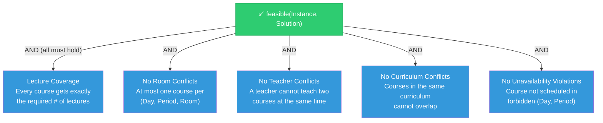
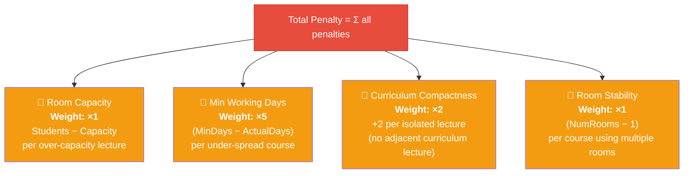
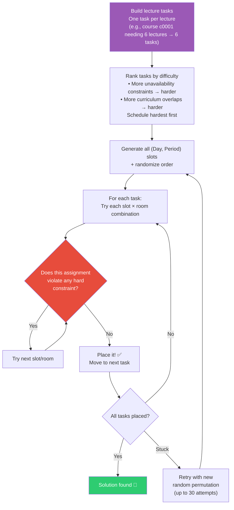
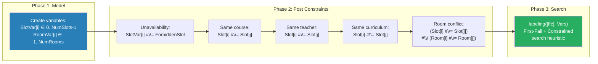
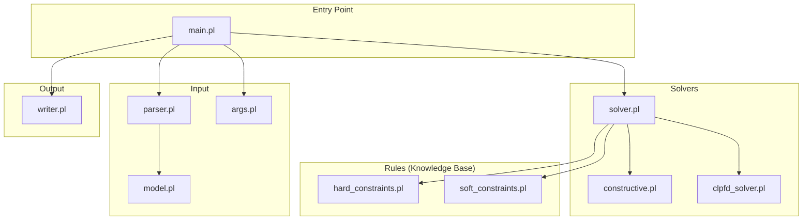

# Presentation Outline: ITC2007 Course Timetabling Expert System

> **Course**: Knowledge-Based Systems (6591)
> **Duration**: ~15 minutes
> **Format**: HTML (reveal.js) — recommended

---

## Slide-by-Slide Breakdown

---

### Slide 1 — Title (30 sec)

**Visual**: Project title, team member names, course code, date

**Content**:
- **Title**: "Solving University Course Timetabling with Prolog"
- **Subtitle**: ITC2007 Track 2 — Curriculum-Based Course Timetabling
- **Built with**: SWI-Prolog | CLP(FD) | Rule-Based Expert System
- Team member name(s)
- Course: COMP 6591 — Knowledge-Based Systems

**🎤 Transcription**:
> "Good [morning/afternoon], everyone. Today we're presenting our final project for Knowledge-Based Systems — a Prolog-based expert system that solves the university course timetabling problem, using benchmark instances from the International Timetabling Competition 2007."

---

### Slide 2 — Why Timetabling? Real-World Motivation (1 min)

**Visual**: An illustration of a chaotic university schedule vs. a clean one. Or a simple infographic showing the stakeholders (students, teachers, rooms).

**Content**:
- Every university faces this problem every semester
- Manually scheduling is error-prone and doesn't scale
- Stakeholders: students (no curriculum clashes), teachers (no double-booking), admin (room utilization)
- It's proven to be **NP-hard** — no known polynomial-time algorithm

**🎤 Transcription**:
> "Why timetabling? Every university has to solve this problem every semester — assigning courses to rooms and time slots. It seems simple, but once you have hundreds of courses, multiple rooms of different sizes, and constraints from curricula, teachers, and room availability, it becomes an NP-hard combinatorial optimization problem. That makes it a perfect candidate for a knowledge-based approach."

---

### Slide 3 — The ITC2007 Competition (1 min)

**Visual**: ITC2007 logo / screenshot of the competition website. A table summarizing the benchmark suite.

**Content**:
- International Timetabling Competition 2007, Track 2
- Curriculum-Based Course Timetabling (CB-CTT)
- Standardized problem format (`.ctt` files)
- **21 benchmark instances** from real Italian universities
- Instances range from small (comp01: 30 courses, 6 rooms) to large (comp05: 54 courses, 9 rooms, 139 curricula, 771 constraints)
- Well-studied benchmark — allows comparing our approach against published results

| Instance | Courses | Rooms | Days | Periods/Day | Curricula | Constraints |
|----------|---------|-------|------|-------------|-----------|-------------|
| comp01   | 30      | 6     | 5    | 6           | 14        | 53          |
| comp05   | 54      | 9     | 6    | 6           | 139       | 771         |
| comp12   | 88      | 11    | 6    | 6           | 150       | 218         |

**🎤 Transcription**:
> "We use the benchmarks from the International Timetabling Competition 2007, Track 2, which focuses on curriculum-based course timetabling. The competition provides 21 standardized instances from real Italian universities, defined in a `.ctt` file format. The instances range in complexity — from comp01 with 30 courses and 6 rooms, up to comp12 with 88 courses and 11 rooms. Using these standardized benchmarks lets us verify our solver's correctness and compare results."

---

### Slide 4 — Problem Formalization: The Input (2 min)

**Visual**: Show a real `.ctt` file excerpt (comp01) alongside the Prolog data structures. Use code highlighting.

**Content — The Raw Input**:
```text
Name: Fis0506-1
Courses: 30
Rooms: 6
Days: 5
Periods_per_day: 6
Curricula: 14
Constraints: 53

COURSES:
c0001 t000 6 4 130    ← CourseId Teacher Lectures MinDays Students
...
ROOMS:
B  200                 ← RoomId  Capacity
...
CURRICULA:
q000  4 c0001 c0002 c0004 c0005   ← CurrId NumCourses CourseList
...
UNAVAILABILITY_CONSTRAINTS:
c0001 4 0              ← CourseId Day Period
```

**Content — Prolog Representation**:
```prolog
% Compound terms for entities
course(CourseId, TeacherId, Lectures, MinDays, Students)
room(RoomId, Capacity)
curriculum(CurriculumId, [Course1, Course2, ...])
unavailable(Course, Day, Period)

% Instance dict holding everything
instance{
    name: "Fis0506-1",
    days: 5,
    periods_per_day: 6,
    courses: [course("c0001","t000",6,4,130), ...],
    rooms: [room("B",200), ...],
    curricula: [curriculum("q000",["c0001","c0002",...]), ...],
    unavailability: [unavailable("c0001",4,0), ...]
}
```

**Content — The Output (Solution)**:
```prolog
assignment(Course, LectureIndex, Day, Period, RoomId)
% e.g. assignment("c0001", 0, 2, 3, "B")
%      → Course c0001, lecture #0, Day 2, Period 3, Room B
```

**🎤 Transcription**:
> "Let me walk you through the problem structure. Each instance file defines courses — with a teacher, number of lectures to schedule, and enrollment count. Rooms have capacities. Curricula group courses that share students — these can't overlap. And there are unavailability constraints — specific time slots where a course cannot be scheduled.
>
> In our Prolog system, we represent these using compound terms — `course/5`, `room/2`, `curriculum/2` — and bundle everything into a Prolog dict we call `Instance`. The solution is a list of `assignment/5` terms, each mapping a specific lecture of a course to a day, period, and room."

---

### Slide 5 — Hard Constraints (AND/OR Diagram) (2 min)

**Visual**: An AND/OR tree diagram showing the hard constraint hierarchy.

**Diagram** (Mermaid):


**Code snippet shown**:
```prolog
feasible(Instance, Solution) :-
    \+ violates(Instance, Solution, _).

violates(Instance, Solution, Reason) :-
    ( violates_lecture_count(Instance, Solution, Reason)
    ; violates_room_conflict(Solution, Reason)
    ; violates_teacher_conflict(Instance, Solution, Reason)
    ; violates_curriculum_conflict(Instance, Solution, Reason)
    ; violates_unavailability(Instance, Solution, Reason)
    ), !.
```

**🎤 Transcription**:
> "A solution is *feasible* only if ALL five hard constraints are satisfied — this is an AND relationship, as shown in the diagram. Let me explain each one:
>
> 1. **Lecture Coverage** — every course must get exactly the number of lectures specified. If a course needs 6 lectures, we need exactly 6 assignments for it.
> 2. **No Room Conflicts** — two different courses cannot be in the same room at the same time.
> 3. **No Teacher Conflicts** — the same teacher can't teach two courses in the same time slot.
> 4. **No Curriculum Conflicts** — courses in the same curriculum share students, so they can't be scheduled at the same time.
> 5. **No Unavailability Violations** — if a course is marked unavailable on Day 4, Period 0, we cannot place it there.
>
> In the Prolog code, `feasible/2` simply checks that no violation exists. The `violates/3` predicate uses disjunction — if *any* single constraint is broken, the whole solution is infeasible."

---

### Slide 6 — Soft Constraints (Weighted Penalty) (2 min)

**Visual**: Another diagram, this time showing the soft constraints as an additive penalty formula. Use a visual formula with colored weights.

**Diagram** (Mermaid):


**Formula shown**:
```
TotalPenalty = RoomCapPenalty
             + MinDaysPenalty
             + CompactnessPenalty
             + StabilityPenalty
```

**Concrete Example** (using comp01 numbers):
| Soft Constraint | Description | Weight | Example |
|-----------------|-------------|--------|---------|
| Room Capacity | 130 students in 100-cap room | ×1 | 130−100 = 30 penalty |
| Min Working Days | 6 lectures in 3 days (needs 4) | ×5 | (4−3)×5 = 5 penalty |
| Curriculum Compactness | Isolated lecture in curriculum | ×2 | 1×2 = 2 penalty |
| Room Stability | Course uses 3 different rooms | ×1 | 3−1 = 2 penalty |

**🎤 Transcription**:
> "Once a solution is feasible, we want to *minimize* the penalty. The ITC2007 defines four soft constraints, each with a different weight to reflect importance.
>
> **Room Capacity** — if 130 students are assigned to a 100-seat room, that's a penalty of 30, times weight 1. **Minimum Working Days** — lectures should be spread across a minimum number of distinct days. If a course needs 4 days but only uses 3, that's a penalty of 5 per missing day. **Curriculum Compactness** — within a curriculum, lectures should be adjacent in time so students don't have gaps. Each isolated lecture costs 2. **Room Stability** — all lectures of a course should ideally use the same room; each extra room adds 1.
>
> The total penalty is the sum of all four. Our greedy solver for comp01 achieves a penalty of around 3,020."

---

### Slide 7 — Solver 1: Greedy Constructive (2 min)

**Visual**: A flowchart/algorithm diagram showing the greedy approach step by step.

**Diagram** (Mermaid):


**Key code shown**:
```prolog
construct(Instance, Solution) :-
    ...
    build_tasks(Instance, CurrMap, Tasks),     % rank by difficulty
    try_attempts(30, Instance, Rooms, Slots,
                 TeacherMap, CurrMap, Tasks, Solution).

can_place(Course, Day, Period, RoomId, Instance, TeacherMap, CurrMap, Acc) :-
    \+ memberchk(unavailable(Course, Day, Period), Instance.unavailability),
    \+ memberchk(assignment(Course, _I, Day, Period, _R), Acc),
    \+ memberchk(assignment(_OC, _OI, Day, Period, RoomId), Acc),
    % ... teacher & curriculum checks
```

**🎤 Transcription**:
> "Our first solver is a greedy constructive approach. Here's how it works:
>
> First, we create one *task* per lecture — so if a course needs 6 lectures, that's 6 tasks. Then we rank these tasks by difficulty — courses with more unavailability constraints or more curriculum overlaps are scheduled first, because they have fewer valid slots.
>
> We generate all possible time slots, randomize them, and for each task, we try every slot and room combination until we find one that doesn't violate any hard constraint. If we get stuck, we retry the whole thing with a new random permutation — up to 30 attempts.
>
> This approach is fast — it solves comp01 in under a second — and it successfully finds feasible solutions for 20 out of 21 instances. The one failure, comp05, is highly constrained with 771 unavailability constraints."

---

### Slide 8 — Solver 2: CLP(FD) Constraint Solver (2 min)

**Visual**: Diagram showing the constraint-posting then labeling paradigm. Show the variable model.

**Diagram** (Mermaid):


**Key code shown**:
```prolog
construct(Instance, Solution) :-
    build_lectures(Instance.courses, Lectures),
    length(Lectures, N),
    length(SlotVars, N),   length(RoomVars, N),
    NumSlots is Instance.days * Instance.periods_per_day,
    SlotVars ins 0..MaxSlot,
    RoomVars ins 1..NumRooms,
    constrain_unavailability(Lectures, SlotVars, ...),
    constrain_pairs(Lectures, SlotVars, RoomVars, ...),
    labeling([ffc], Vars),    % search with First-Fail heuristic
    build_solution(Lectures, SlotVars, RoomVars, ...).
```

**🎤 Transcription**:
> "Our second solver uses CLP(FD) — Constraint Logic Programming over Finite Domains, which is built into SWI-Prolog. This is a fundamentally different approach.
>
> Instead of greedily placing lectures one by one, we create *variables* — one slot variable and one room variable per lecture. Each slot variable has a domain of all possible time slots, and each room variable ranges over available rooms.
>
> Then we *post constraints* — all five hard constraints become mathematical constraints on these variables. For example, if two courses share a teacher, their slot variables must be different. The room conflict says: either two lectures are in different slots, OR they're in different rooms.
>
> Finally, we call `labeling` with the `ffc` heuristic — First-Fail, most Constrained — which automatically searches the solution space. CLP(FD) is elegant but computationally heavier. It solves 5 of the 21 instances within the timeout — it guarantees *all* hard constraints are satisfied by construction."

---

### Slide 9 — Results Comparison (1.5 min)

**Visual**: A results table with color coding. Green for success, red for failure/timeout.

**Content**:

| Instance | Greedy Status | Greedy Penalty | CLP(FD) Status | CLP(FD) Penalty |
|----------|:------------:|:--------------:|:--------------:|:---------------:|
| comp01   | ✅ ok        | 3,020          | ⏱ timeout      | —               |
| comp02   | ✅ ok        | 7,483          | ⏱ timeout      | —               |
| comp03   | ✅ ok        | 5,834          | ✅ ok           | 7,949           |
| comp04   | ✅ ok        | 5,212          | ✅ ok           | 7,063           |
| comp05   | ❌ failed    | —              | ⏱ timeout      | —               |
| comp09   | ✅ ok        | 5,013          | ✅ ok           | 7,401           |
| comp11   | ✅ ok        | 1,987          | ⏱ timeout      | —               |
| comp12   | ✅ ok        | 5,066          | ✅ ok           | 4,822           |
| comp15   | ✅ ok        | 5,834          | ✅ ok           | 7,949           |

**Summary stats**:
- **Greedy**: 20/21 feasible solutions (95%), avg penalty ~5,300
- **CLP(FD)**: 5/21 within timeout (24%), but *guarantees* hard-constraint satisfaction
- CLP(FD) sometimes achieves better penalty (comp12: 4,822 vs 5,066) since it explores differently

**🎤 Transcription**:
> "Let's compare results. The greedy solver successfully produces feasible solutions for 20 out of 21 instances — a 95% success rate. The only failure is comp05, the most constrained instance with 771 unavailability constraints.
>
> The CLP(FD) solver, on the other hand, only completes 5 instances within the 2-minute timeout. This is expected — CLP(FD) performs exhaustive constraint propagation and search, which is computationally expensive. However, it's interesting that on comp12, CLP(FD) actually achieves a *lower* penalty than greedy — 4,822 versus 5,066.
>
> The greedy solver's strength is speed and scalability. The CLP(FD) solver's strength is elegance and correctness guarantees. For a production system, you might combine both — use CLP(FD) for small instances and greedy for large ones."

---

### Slide 10 — Live Demo (2 min)

**Visual**: Terminal or TUI running in the presentation.

**Demo plan**:
1. Show the `.ctt` input file briefly
2. Run `make run INSTANCE=data/itc2007/comp01.ctt OUT=results/demo.sol`
3. Show the output `.sol` file
4. Show the CSV with feasible=true, penalty
5. (Optional) Show the Python TUI: `make run-tui`

**🎤 Transcription**:
> "Let me give you a quick demo. Here's the comp01 instance file — 30 courses, 6 rooms, 5 days with 6 periods each. I'll run our greedy solver...
>
> [runs the command]
>
> It finished in about a second. Let's look at the solution file — each line assigns a course to a room, day, and period. And here's the CSV output — feasible: true, penalty: about 3,000.
>
> [if time allows, show TUI]
> We also built a Python terminal interface that lets you browse instances, select solvers, and inspect results interactively."

---

### Slide 11 — Architecture & Lessons Learned (1 min)

**Visual**: The module dependency diagram from the project docs.



**Key Takeaways**:
- Prolog's pattern matching = natural fit for constraint checking
- SWI-Prolog dicts = readable structured data
- CLP(FD) is powerful but search space explodes on large instances
- Separating rules from solver = clean architecture for a KBS
- plunit testing framework caught bugs early

**🎤 Transcription**:
> "Here's our system architecture. The key design decision was separating the *knowledge base* — the hard and soft constraint rules — from the *solvers*. This is a classic expert system pattern: the knowledge base defines *what* constraints must hold, and the solver decides *how* to satisfy them.
>
> Prolog was a great fit. Pattern matching on compound terms like `course/5` makes constraint checking very natural. And SWI-Prolog's dict syntax made the instance model readable. The main lesson: CLP(FD) is elegant and correct by construction, but the greedy approach is far more practical for large instances."

---

### Slide 12 — Thank You & Q&A (30 sec)

**Visual**: "Questions?" with repo link and key references.

**Content**:
- 🔗 Repository link
- 📚 References:
  - ITC2007 Competition: https://www.eeecs.qub.ac.uk/itc2007/
  - SWI-Prolog CLP(FD): https://www.swi-prolog.org/pldoc/man?section=clpfd
  - Di Gaspero & Schaerf, "Neighborhood Portfolio Approach for Local Search Applied to Timetabling Problems" (2006)
- "Thank you! Questions?"

**🎤 Transcription**:
> "That wraps up our presentation. To summarize — we built a Prolog-based expert system for course timetabling using ITC2007 benchmarks. We implemented two solvers: a fast greedy approach solving 20 of 21 instances, and a CLP(FD) approach demonstrating the power of constraint programming. Thank you! We're happy to take questions."

---

## Timing Summary

| Slide | Topic | Time |
|-------|-------|------|
| 1 | Title | 0:30 |
| 2 | Motivation | 1:00 |
| 3 | ITC2007 Competition | 1:00 |
| 4 | Problem Formalization & Data Structures | 2:00 |
| 5 | Hard Constraints (AND diagram) | 2:00 |
| 6 | Soft Constraints (weighted penalty) | 2:00 |
| 7 | Greedy Constructive Solver | 2:00 |
| 8 | CLP(FD) Solver | 2:00 |
| 9 | Results Comparison | 1:30 |
| 10 | Live Demo | 2:00 |
| 11 | Architecture & Lessons | 1:00 |
| 12 | Q&A | 0:30+ |
| | **Total** | **~15:30** |

> [!TIP]
> If running short on time, you can cut Slide 11 (Architecture) and integrate "Lessons Learned" into Q&A answers. If running long, shorten the demo to just one command run.

---

## Potential Questions & Suggested Answers

### Q1: "Why did you choose Prolog instead of Python or Java?"

> **A**: Prolog is a natural fit for knowledge-based systems because of its built-in unification, pattern matching, and backtracking. Constraints can be expressed as logical rules, which maps directly to how expert systems work. Plus, SWI-Prolog includes CLP(FD) out of the box, so we could implement a constraint solver without external libraries.

### Q2: "Why does the greedy solver fail on comp05?"

> **A**: comp05 is the most constrained instance — 54 courses, 139 curricula, and 771 unavailability constraints. The greedy solver tries to place lectures one at a time, and with so many restrictions, it gets stuck even with 30 random restarts. A local search or metaheuristic (like simulated annealing or tabu search) would likely solve it, but that was beyond our scope.

### Q3: "Why does CLP(FD) time out on most instances?"

> **A**: CLP(FD) performs constraint propagation and systematic search (essentially backtracking with domain pruning). The search space for, say, comp01 is roughly 30^(number of lectures) × 6^(number of lectures) — it grows exponentially. The `ffc` (first-fail, most constrained) heuristic helps but isn't enough for large instances. In practice, CLP(FD) works well for small instances or as a sub-solver.

### Q4: "What is the `ffc` labeling strategy?"

> **A**: `ffc` stands for "first-fail, most constrained." When choosing which variable to assign next, CLP(FD) picks the one with the *smallest remaining domain*. The idea is: if a variable has very few options, assign it now before those options disappear. It's one of the most effective generic search heuristics for CSPs.

### Q5: "Could you improve the penalty scores?"

> **A**: Absolutely. The greedy solver doesn't optimize for soft constraints at all — it just finds any feasible solution. To improve penalty, we could add:
> - **Local search** (simulated annealing, hill climbing) to swap/move assignments after construction
> - **Penalty-aware placement** in the greedy phase (prefer rooms matching enrollment, spread across days)
> - **Multi-start**: run the greedy solver many times with different seeds and keep the lowest penalty

### Q6: "How does the `violates_partial/3` predicate differ from `violates/3`?"

> **A**: `violates/3` checks ALL hard constraints including whether every course has the right number of lectures. `violates_partial/3` skips the lecture-count check — it's used during construction when the solution is still being built. Obviously, a half-built solution won't have all lectures yet; we only enforce structural constraints during placement and check completeness at the end.

### Q7: "Why use Prolog dicts instead of plain lists or terms?"

> **A**: Dicts provide named field access — `Instance.days`, `Instance.courses` — which is more readable than positional args in a compound term. For an instance with 10+ fields, `instance(Name,Days,Periods,...)` would be unreadable. Dicts also support functional update with `put/3`, making it easy to add courses during parsing.

### Q8: "What's the difference between curriculum-based and exam-based timetabling?"

> **A**: Curriculum-based timetabling (Track 2 of ITC2007) assigns *courses* to time slots and rooms, where students are grouped by curricula. Exam-based timetabling assigns *exams* and typically deals with individual student enrollments. The constraint structures are different — curriculum-based is about group conflicts, exam-based is about individual conflicts.

### Q9: "How do you handle the room assignment in CLP(FD)?"

> **A**: Each lecture gets a room variable `RoomVar[i]` with domain `1..NumRooms`. We encode the room conflict constraint as: for any two lectures i and j, `(Slot[i] #\= Slot[j]) #\/ (Room[i] #\= Room[j])` — meaning they must either be at different times or in different rooms. This is a reified disjunction, which CLP(FD) handles natively.

### Q10: "How do you ensure the greedy solver terminates?"

> **A**: It has a hard limit of 30 attempts. Each attempt tries random permutations of slots, rooms, and task ordering. Within an attempt, the solver places lectures one by one with deterministic `can_place` checks (using `!` to commit to the first valid placement). If it can't place a lecture, the attempt fails and we retry. After 30 failures, the predicate fails and the solver reports infeasible.

### Q11: "Why is the weight for Minimum Working Days higher (×5) than others?"

> **A**: The weights are defined by the ITC2007 competition — we didn't choose them. The rationale is that spreading lectures across days is more important for student learning than, say, room stability. A course with all 6 lectures on the same day would be terrible for students, hence the higher penalty weight.

### Q12: "Could you combine both solvers?"

> **A**: Yes! A practical approach would be: try CLP(FD) first with a short timeout; if it succeeds, great. If it times out, fall back to the greedy solver. Or use CLP(FD) to solve the hardest sub-problem (most constrained courses) and greedy for the rest. This is called a *hybrid* approach and is common in state-of-the-art timetabling solvers.

### Q13: "How is this an 'expert system' as opposed to just an optimizer?"

> **A**: It follows the expert system pattern: we have a clear separation between the **knowledge base** (the constraint rules in `hard_constraints.pl` and `soft_constraints.pl`) and the **inference engine** (the solver). The rules encode domain expert knowledge about what makes a valid timetable. The solver reasons over these rules. Adding a new constraint means adding a new rule, not rewriting the solver.

### Q14: "What testing did you do?"

> **A**: We have plunit test suites for the parser, constructive solver, and CLP(FD) solver. We test with a small fixture (`mini.ctt` — 2 courses, 2 rooms) where we can manually verify results. We also ran batch tests on all 21 instances with both solvers, recording feasibility status and penalty in CSV files. The `test_hard_constraints_clpfd.pl` specifically verifies that hard constraints behave correctly with CLP(FD) variables.

### Q15: "What would you do differently if you started over?"

> **A**: Three things: (1) Add a **local search** phase after construction to reduce penalty, (2) Implement **symmetry breaking** in the CLP(FD) model to prune the search space, and (3) Add a **soft constraint** objective to the CLP(FD) model using `labeling([min(Penalty)])` to find optimal solutions, not just feasible ones.
